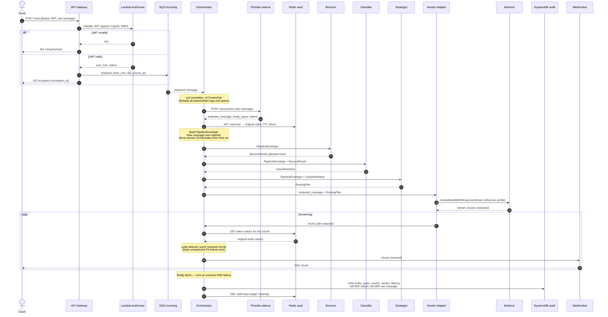

# AI Routing System — Project Summary

## Project overview

Building an AI message routing system that reads messages from a chatbot and dispatches them to appropriate AI vendors based on message context, safety, and business rules. This is a multi-layer router where each layer makes a focused decision before handing off to the next.

---

## Technology stack

- **Language**: Python 3.12, FastAPI, FastMCP
- **LLM API**: AWS Bedrock for all LLM calls (no direct vendor API clients)
- **Models**: `claude-haiku-4-5` for fast gating, `claude-sonnet-4-6` for reasoning
- **Queuing**: AWS SQS (incoming, escalation, dead-letter queues)
- **Caching**: ElastiCache Redis (user context, session history, token vault)
- **Config store**: DynamoDB (routing rules)
- **Compute**: ECS Fargate (latency-sensitive layers) + Lambda (stateless tasks)
- **Authentication**: Amazon Cognito User Pool + JWT (RS256 access tokens, validated at API Gateway)
- **Region**: ap-southeast-1 (Singapore)
- **Observability**: CloudWatch metrics, X-Ray tracing, S3 archival

---

## Architecture — the five processing layers

### High-level flow

```
Requester
    ↓
API Gateway → SQS (incoming queue)
    ↓
Bouncer          (two-layer gate: rules + Haiku)
    ↓ allowed
Intent classifier (Sonnet + MCP tools)
    ↓
Routing strategist (rules + occasional Haiku)
    ↓
Vendor adapters   (Claude, GPT, etc.)
    ↓
WebSocket / SSE response channel → Requester
```

Every message carries a `correlation_id` that threads through all layers for end-to-end tracing.

### End-to-end request sequence

The diagram below is the canonical reference for "what runs in what order" through a single request. Key invariants to read off it: the raw message exists only briefly inside the Orchestrator (steps 9–10), redaction happens once and uniformly (step 10), every downstream layer sees only the redacted `PipelineEnvelope`, and the audit + vault cleanup runs in a `finally` block regardless of success or failure.



---

## Layer 1 — Bouncer

**Purpose**: First gate. Rejects invalid, malicious, or abusive input before any downstream cost is incurred.

**Design**: Two sublayers run in sequence.

- **Rule-based gate** (no LLM, pure Python): length checks, prompt injection regex, banned user check, rate limit. Runs in microseconds.
- **LLM micro-classifier** (Haiku via Bedrock): assesses safety of messages that pass the rule gate. Max 50 tokens output. Returns `{pass, reason, confidence}`.

**Behaviour**:
- Confidence ≥ 0.7 and pass = true → allow downstream
- Confidence < 0.7 → escalate to human review queue (not reject)
- 200ms total timeout → fail open (allow downstream, log warning)

**Tools**: No MCP tools. The Bouncer relies solely on the rule gate and Haiku's own safety assessment.

### Sequence

Read this diagram before writing Bouncer code. **The fail-open posture is the one most often coded wrong** — the natural instinct on timeout is to raise and reject, but the spec requires allowing the request through with `timed_out=true`. The `option` branches of the `critical` block below show every non-happy path resolving to `allowed=true`. The only path that hard-blocks the user is rule-gate rejection (banned user, prompt injection, rate limit) — Haiku errors and timeouts never block.

```mermaid
sequenceDiagram
    autonumber
    participant Orch as Orchestrator
    participant Gate as Rule Gate (in-process)
    participant Haiku as Haiku micro-classifier
    participant Bedrock as Bedrock (Haiku)
    participant Redis
    participant Metrics as CloudWatch

    Note over Orch,Metrics: 200ms TOTAL budget for rule gate + Haiku.<br/>Spec: this layer FAILS OPEN, never fails closed.

    Orch->>Gate: PipelineEnvelope
    activate Gate

    Note right of Gate: Length, prompt-injection regex,<br/>banned-user check, rate limit.<br/>No LLM. Microseconds.

    Gate->>Redis: GET banned:{user_sub}, ratelimit:{user_sub}
    Redis-->>Gate: status

    alt Rule gate REJECTS
        Gate-->>Orch: BounceResult(allowed=false, layer=rule_gate)
        deactivate Gate
        Note over Orch: short-circuit — Haiku not called
    else Rule gate PASSES
        deactivate Gate
        Orch->>Haiku: redacted_message + remaining budget
        activate Haiku

        critical Haiku call must complete within remaining budget
            Haiku->>Bedrock: InvokeModel (apac.* inference profile, max_tokens=50)
            Bedrock-->>Haiku: {pass, reason, confidence}

            alt confidence >= 0.7 AND pass = true
                Haiku-->>Orch: BounceResult(allowed=true, layer=llm_classifier)
            else confidence < 0.7
                Haiku-->>Orch: BounceResult(allowed=true, escalate=true)
                Note over Orch: also writes Review Log entry<br/>(async, DynamoDB)
            end

        option Budget exceeded (timeout)
            Note over Haiku,Bedrock: FAIL OPEN — do not raise, do not reject.
            Haiku-->>Orch: BounceResult (see note)
            Note right of Orch: allowed=true<br/>timed_out=true<br/>layer=timeout_fail_open<br/>confidence=0.0
            Haiku->>Metrics: BouncerTimeout += 1

        option Bedrock error
            Note over Haiku,Bedrock: FAIL OPEN — same posture as timeout.
            Haiku-->>Orch: BounceResult (see note)
            Note right of Orch: allowed=true<br/>timed_out=false<br/>layer=timeout_fail_open<br/>confidence=0.0
            Haiku->>Metrics: BouncerError += 1
        end
        deactivate Haiku
    end

    Note over Orch: ANY result above continues the pipeline.<br/>The only path that blocks the user is rule gate hard-reject.
```

---

## Layer 2 — Intent classifier

**Purpose**: Decides what the user wants so the next layer knows who should handle it.

**Taxonomy** (three levels: domain → intent → sub-intent):
- `general_qa` → claude-sonnet
- `code_assistance` → claude-sonnet
- `simple_transactional` → claude-haiku (cheap)
- `out_of_scope` / `ambiguous` → escalation

**Two-path design**:
- **Fast path** — embedding similarity (Bedrock Titan) against known intent vectors. Runs for short simple messages in ~20ms.
- **Deep path** — Claude Sonnet with MCP tools. For complex or multi-domain queries.

**MCP tools**:
- `get_intent_taxonomy` — taxonomy from DynamoDB
- `get_session_history` — last 3 turns for pronoun resolution
- `check_guardrails` — Bedrock Guardrails content check
- `get_entity_context` — known entities for this user

**Output**: `ClassifiedIntent` with intent, sub_intent, domain, confidence, entities, `resolved_message` (pronouns resolved), reasoning, multi_domain flag.

**Escalate if confidence < 0.6** instead of guessing.

---

## Layer 3 — Routing strategist

**Purpose**: Decides which vendor handles the request, with what fallback chain, under what policies.

**Three execution paths by confidence**:
- `≥ 0.85` → deterministic rule map, no LLM
- `0.5 – 0.85` → Haiku arbitration call (max 80 tokens)
- `< 0.5` → escalate to human review

**Always-parallel MCP tool fetches**: `check_vendor_health`.

**Policy engine** (runs after vendor selection, before output):
- Data residency (SG users → Bedrock ap-southeast-1 only)
- Legal/compliance blocks (MAS-regulated queries, tenancy law)
- Cross-jurisdiction flags (overseas content for SG user)

**Fallback chain**: intent-aware per-vendor timeouts (3s for Haiku, 8s for Sonnet). Each step has its own retry count and backoff strategy.

**Output**: `RoutingPlan` with primary vendor, fallback chain, `RoutingContext`, applied policies, audit metadata.

---

## Layer 4 — Vendor adapters

All vendors unified behind Bedrock. Single boto3 client handles Claude, Llama, Mistral. Streaming enabled for chat-like UX.

---

## Compute decisions (per component)

| Component | Platform | Reasoning |
|---|---|---|
| Orchestrator | **Lambda (VPC-attached)** | Stateless SQS consumer; bursty; not in tight latency budget; VPC needed for Redis + Presidio |
| Rule-based gate | **Lambda** | Pure Python, stateless, bursty |
| Haiku classifier | **ECS Fargate** | 200ms budget can't absorb Lambda cold start; needs persistent Bedrock + Redis connections |
| SQS consumers | **Lambda** | Native SQS trigger, scales with queue depth |
| Intent classifier | **ECS Fargate** | Persistent MCP clients, in-memory taxonomy cache |
| Routing strategist | **Lambda** | 80–90% pure rule lookups, occasional LLM call well within 15min limit |
| Vendor adapters | **ECS Fargate** | Streaming responses need persistent HTTP |
| Admin dashboard (FastAPI) | **ECS Fargate** | Persistent Redis + DynamoDB connections; read-heavy, low concurrency |
| WebSocket server | **ECS Fargate** | Cannot hold persistent connections on Lambda |
| Redaction (Presidio) | **ECS Fargate sidecar** | ~200MB NLP model must stay resident; called by Orchestrator over VPC-internal HTTP |
| API Gateway authoriser | **Lambda** | Stateless JWT validation against Cognito JWKS; millisecond execution |

**Rule of thumb**: Lambda for stateless/bursty; ECS for persistent connections or tight latency budgets.

---

## PII redaction — decision: **Position C (consistent sensitivity-based redaction)**

**Core principle**: Bedrock is Bedrock. If PII is sensitive enough to redact before Claude, it's sensitive enough to redact before Haiku and Sonnet too. Single redaction pass at the top of the pipeline, applied uniformly to every LLM call.

**What gets redacted** (high-sensitivity only):
- SG_NRIC, SG_FIN, SG_UEN, SG_PASSPORT
- CREDIT_CARD, IBAN_CODE
- Large currency figures (>$X threshold)

**What stays raw** (contextual, needed for classification accuracy):
- LOCATION, PERSON, DATE_TIME, PHONE_NUMBER, EMAIL_ADDRESS

**Flow**:
1. Single input redaction at orchestrator entry (Presidio + token vault in Redis, 5-min TTL)
2. All three LLM calls (Haiku bouncer, Sonnet classifier, vendor Claude) see the same redacted message
3. Output restoration unwinds tokens after vendor response
4. Leak detector scans restored response for unexpected PII and strips it
5. Audit logger records entity types and counts only — never values
6. Session cache stores the redacted version of each turn

**Library**: Microsoft Presidio (open source, runs as sidecar) with custom Singapore recognisers for NRIC, FIN, UEN. Bedrock Guardrails as defence-in-depth on output only.

**Streaming case**: buffer-and-scan pattern with 200-char buffer and 50-char safety margin for mid-entity splits.

---

## Presidio sidecar deployment

**Decision**: Persistent ECS Fargate HTTP service (Option A) — not in-process Lambda or container-image Lambda.

**Rationale**: The ~200MB spaCy NLP model must stay resident between requests. Running it inside the Orchestrator Lambda would impose a 3–8s cold start per new Lambda instance. ECS keeps the model warm permanently and the network hop within the VPC is ~1–2ms.

**Topology**:
```
VPC (ap-southeast-1)
├── Private subnet
│   ├── ECS Fargate Service: presidio-sidecar
│   │     Container: presidio HTTP server (port 8080)
│   │     Auto-scaling: min 1 task, max N tasks
│   │     Health check: GET /health → 200 OK
│   │
│   ├── Lambda: orchestrator (VPC-attached)
│   │     Env: PRESIDIO_URL=http://presidio.internal:8080
│   │     Calls: POST /anonymize
│   │
│   └── AWS Cloud Map (service discovery)
│         presidio.internal → ECS task IPs
```

**Redis token vault**: Tokens stored as `vault:{correlation_id}:{token}` with 5-minute TTL. Output redactor looks up and restores tokens after vendor response.

---

## Key handoff contracts

```python
BounceResult        → allowed, reason, layer, confidence, escalate, timed_out
ClassifiedIntent    → intent, sub_intent, domain, confidence, entities,
                      resolved_message, multi_domain, escalate, reasoning
RoutingPlan         → primary_vendor, fallback_chain, context, applied_policies,
                      policy_modified, blocked
RedactionResult     → redacted_message, entity_types_found, entity_count,
                      was_redacted, correlation_id
PipelineEnvelope    → correlation_id, user_sub, session_id, redacted_message,
                      raw_message_hash, entity_types_redacted, entity_count,
                      was_redacted, timestamp, bedrock_region, source_ip
```

---

## Authentication — Amazon Cognito + JWT

**Flow**:
1. Client authenticates against Amazon Cognito User Pool and receives a JWT access token (RS256)
2. Client sends API request with `Authorization: Bearer <token>` header
3. API Gateway validates JWT signature against Cognito JWKS endpoint and checks `exp`, `iss`, `aud`, `token_use` claims
4. Invalid tokens rejected at the edge with HTTP 401 — no payload reaches SQS or the pipeline
5. Validated `user_sub` (Cognito UUID) is injected into request context and flows through the pipeline as part of PipelineEnvelope

**Token TTLs**: Access token 60 minutes, refresh token 30 days. Refresh token never sent to the API.

**user_sub usage in pipeline**: banned user check (Bouncer), rate limit keys (Bouncer), session history lookup (Classifier), audit record (Orchestrator). Never the email address or any PII-bearing claim.

---

## MCP usage pattern

**Inbound**: Router exposed as FastMCP server (ECS Fargate) so external agents can call `route_message` and `get_routing_status` tools.

**Outbound** (agents as MCP clients):
- Bouncer → no MCP tools (rule gate only)
- Classifier → taxonomy, session history, guardrails, entity context servers
- Routing strategist → vendor health, routing rules servers

Each MCP server owns one domain of data — replaceable, testable, reusable.

---

## LiteLLM integration — recommended hybrid

Keep custom layers for business logic (bouncer, classifier, strategist). Use **LiteLLM as the vendor adapter layer** — it handles multi-model API differences, fallbacks, retries, cost tracking as a proven commodity. Custom logic stays where it differentiates; commodity work is delegated.

---

## Phased rollout approach

- **Phase 1 (MVP)**: All ECS Fargate, single service per logical layer. Simpler to debug.
- **Phase 2**: Migrate stateless layers (rule gate, SQS consumers, routing strategist) to Lambda once traffic data justifies it.
- **Phase 3**: Add Lambda provisioned concurrency where cold starts show up in CloudWatch metrics.
- **Handoff pattern**: Start with direct async calls within one ECS service (Option A). Migrate to per-layer SQS queues (Option B) when horizontal scaling pressure demands it.

---

## File structure (target)

```
bouncer/
  models.py, rule_gate.py, llm_classifier.py,
  bouncer.py, config.py

classifier/
  models.py, fast_path.py, deep_path.py, taxonomy.py,
  session_history.py, classifier.py

strategist/
  models.py, vendor_selector.py, policy_engine.py,
  fallback_chain.py, strategist.py

redactor/
  models.py, vault.py, recognisers.py, input_redactor.py,
  output_redactor.py, streaming_redactor.py, audit_logger.py

adapters/
  base.py, bedrock_client.py, litellm_adapter.py

orchestrator/
  orchestrator.py, sqs_consumer.py, envelope.py,
  presidio_client.py, vault.py, pipeline_driver.py,
  output_handler.py, audit.py, observability.py,
  websocket_server.py, config.py

mcp_servers/
  router_server.py, taxonomy_server.py,
  vendor_health_server.py, etc.

admin/
  main.py, auth.py, models.py
  routers/ (metrics, escalations, routing_rules, users, audit, test_console)
  services/ (cloudwatch, sqs_admin, dynamo_admin, redis_admin)

presidio_sidecar/
  main.py, Dockerfile

infra/
  terraform/ or cdk/
```

---

## Admin Dashboard

**Purpose**: Operational monitoring, human review queue management, routing configuration, compliance auditing, and an embedded test console — all within a single authenticated interface.

**Deployment**: React SPA served from S3 + CloudFront. Backend is a dedicated FastAPI service on ECS Fargate (persistent Redis + DynamoDB connections; read-heavy, low concurrency). Strict read-heavy design — the only write surface is the DynamoDB routing rule editor, tier overrides, and escalation queue resolve/reject actions. Never touches the live routing path directly.

**Authentication**: Same Cognito User Pool as the main pipeline. Admin service runs behind a separate ALB listener rule (`/admin/*`) with IP allowlisting. IAM role explicitly denies `bedrock:*`, `sqs:SendMessage` on the incoming queue, and `dynamodb:DeleteItem`.

**Seven views**:
- **Pipeline health** — per-layer throughput, latency (p50/p99/p999), error rate, escalation rate from CloudWatch
- **Bouncer** — pass/fail/escalate rates, confidence histogram, top blocked patterns
- **Classifier** — intent distribution, fast vs deep path split, confidence distribution
- **Strategist** — vendor selection breakdown, policy engine trigger counts
- **Escalation queue** — list pending SQS human review messages (redacted previews only); approve (release to routing), reject (DLQ), or requeue with annotation
- **Routing rules** — DynamoDB CRUD for intent→vendor mapping; changes take effect immediately with no redeployment
- **Audit log** — entity type counts, policies applied, vendor used per correlation_id; S3-backed with 365-day retention

**Test console**: Embedded tool allowing admins to submit a message and trace it through the full pipeline (or dry-run stopping before vendor invocation). Shows BounceResult → ClassifiedIntent → RoutingPlan → vendor response with per-layer latencies and the redacted message at each stage. Generates its own correlation_id, logged to CloudWatch.

**Key API endpoints**:
```
GET  /admin/metrics/pipeline              # per-layer health
GET  /admin/metrics/bouncer               # safety classifier stats
GET  /admin/metrics/classifier            # intent distribution
GET  /admin/metrics/redaction             # entity type counts (never values)
GET  /admin/escalations                   # pending SQS review queue
POST /admin/escalations/{id}/approve      # release to routing layer
POST /admin/escalations/{id}/reject       # move to DLQ
POST /admin/escalations/{id}/requeue      # send back with annotation
GET/PUT /admin/routing-rules/{intent}     # edit per-intent routing rule
GET  /admin/audit                         # audit log query
POST /admin/test-console                  # full-trace or dry-run submission
GET  /admin/health                        # service health (DynamoDB, Redis, SQS reachability)
```

**PII constraints** (inherit system non-negotiables):
- Escalation previews show redacted messages only — tokens never surfaced in UI
- Audit log surfaces entity types and counts, never values
- Admin service logs use allowlist-based structured logging (same as pipeline)
- `redis_admin.py` reads aggregate stats only — `HGETALL` and `SCAN` on vault namespace are forbidden
- Test console trace logs redacted messages only; never model input/output text

**Monitoring**: Admin service emits to `AIRouter/Admin` CloudWatch namespace. Alarm fires if escalation queue depth exceeds 50 messages or admin service error rate exceeds 5% for 5 consecutive minutes.

---


1. **All LLM calls go through Bedrock** — no direct Anthropic/OpenAI API keys
2. **JWT validated at the edge** — API Gateway rejects unauthenticated requests before any pipeline code executes
3. **Single redaction policy applied uniformly** across Haiku, Sonnet, and vendor Claude
4. **Fail-open bouncer** — never hard-block users if the gate times out
5. **Correlation ID threads everything** — every log line, every queue message, every trace
6. **No PII in logs ever** — allowlist-based structured logging, error type not error message
7. **Bedrock invocation logging disabled** for all model calls to prevent PII leaking via AWS logs
8. **Escalate, don't guess** — when confidence is low at any layer, route to human review rather than pick a vendor
9. **Data residency enforced at IAM level** — Bedrock calls locked to ap-southeast-1 by IAM policy, not only by the policy engine
10. **Raw message never leaves the Orchestrator** — only redacted_message in PipelineEnvelope passes downstream
